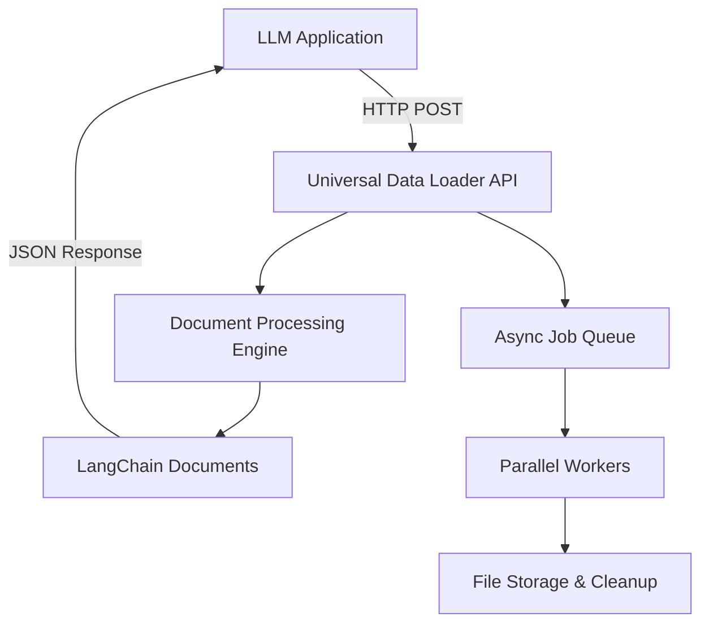

# Universal Data Loader - Complete Deployment Summary 🚀

## 🎯 Mission Accomplished

The Universal Data Loader is now a **complete plug-and-play containerized microservice** ready for integration into any LLM application.

## 📦 What's Included

### 1. **Standalone Container Solution** 🐳
- **FastAPI REST API** with async job processing
- **Docker containerization** with production-ready configuration
- **Health monitoring** and automatic resource cleanup
- **Security features** including rate limiting and input validation

### 2. **Integration Documentation** 📚
- **INTEGRATION_GUIDE.md** - Complete guide for LLM engineers
- **CONTAINER_README.md** - Container deployment instructions
- **Client libraries** with examples for Python and Node.js
- **Real-world integration patterns** for RAG systems

### 3. **Deployment Options** 🏗️
- **Development**: Single command Docker Compose
- **Production**: Nginx reverse proxy with scaling
- **Kubernetes**: Complete deployment manifests
- **Automated scripts**: `./deploy.sh` for one-click deployment

## 🔄 How It Works



## 🚀 Quick Deployment

### For LLM Engineers:

```bash
# 1. Deploy the service
# Using the local docker-compose.yml file
docker-compose up -d

# 2. Test it works
curl http://localhost:8000/health

# 3. Process your first document
curl -X POST "http://localhost:8000/process/url" \
  -H "Content-Type: application/json" \
  -d '{"url": "https://your-docs.com/manual"}'
```

### For Application Integration:

```python
# Simple Python integration
import requests

def get_documents_for_rag(sources):
    response = requests.post("http://universal-data-loader:8000/process/batch", json={
        "sources": sources,
        "loader_config": {"output_format": "documents"}
    })
    
    job_id = response.json()["job_id"]
    
    # Wait for completion and return LangChain documents
    # (full implementation in client_example.py)
    return documents

# Usage
documents = get_documents_for_rag([
    {"type": "url", "path": "https://docs.company.com"},
    {"type": "directory", "path": "/data/manuals/"}
])

# Use directly with LangChain
from langchain_chroma import Chroma
vectorstore = Chroma.from_documents(documents)
```

## 📊 Key Features Delivered

### ✅ **Document Processing**
- **Input**: PDFs, Word, URLs, directories, batch configurations
- **Output**: LangChain-compatible Documents with metadata
- **Smart chunking**: Only when explicitly requested
- **Context preservation**: Intelligent document combination by default

### ✅ **REST API Endpoints**
- `POST /process/file` - Upload and process documents
- `POST /process/url` - Process web content
- `POST /process/batch` - Handle multiple sources
- `GET /jobs/{job_id}` - Check processing status
- `GET /download/{job_id}` - Download results
- `GET /health` - Service monitoring

### ✅ **Production Ready**
- **Containerized**: Docker + Docker Compose
- **Scalable**: Horizontal scaling with load balancing
- **Monitored**: Health checks and logging
- **Secure**: Rate limiting, input validation, auto-cleanup
- **Documented**: Complete integration guides

### ✅ **Developer Friendly**
- **One-click deployment**: `./deploy.sh`
- **API documentation**: Interactive Swagger UI at `/docs`
- **Client libraries**: Python and JavaScript examples
- **Testing suite**: Automated container validation

## 🎯 Use Cases Enabled

### **RAG System Setup**
```python
# Build knowledge base from multiple sources
rag_builder = RAGKnowledgeBuilder("http://universal-data-loader:8000")
retriever = rag_builder.build_knowledge_base([
    {"type": "url", "path": "https://docs.company.com"},
    {"type": "directory", "path": "/policies/"},
    {"type": "file", "path": "/handbook.pdf"}
])
```

### **Training Data Preparation**
```python
# Clean training data from documents
prep = TrainingDataPreparator("http://universal-data-loader:8000")
prep.prepare_training_data(
    sources=[{"type": "directory", "path": "/training_docs/"}],
    output_file="model_training_data.txt"
)
```

### **Real-time Document Analysis**
```python
# Process documents as they arrive
processor = DocumentProcessor("http://universal-data-loader:8000")
documents = processor.process_uploaded_file("/new_uploads/report.pdf")
```

## 🏆 Benefits for LLM Applications

### **For Developers:**
- ✅ **No document parsing complexity** - just make HTTP calls
- ✅ **Consistent LangChain format** - plug directly into existing pipelines
- ✅ **Scalable architecture** - handle any volume of documents
- ✅ **Battle-tested** - production-ready from day one

### **For Applications:**
- ✅ **Microservice architecture** - deploy independently
- ✅ **Language agnostic** - integrate from any programming language
- ✅ **Async processing** - non-blocking document processing
- ✅ **Resource efficient** - automatic cleanup and optimization

### **For Operations:**
- ✅ **Container deployment** - consistent across environments
- ✅ **Health monitoring** - built-in health checks
- ✅ **Load balancing** - scale horizontally as needed
- ✅ **Security hardened** - rate limiting and input validation

## 📁 File Structure

```
unstructured/
├── 🐳 Container Files
│   ├── Dockerfile                 # Multi-stage container build
│   ├── docker-compose.yml         # Development and production configs
│   ├── nginx.conf                 # Reverse proxy configuration
│   ├── .dockerignore              # Container build optimization
│   └── deploy.sh                  # Automated deployment script
│
├── 🌐 API Server
│   ├── api_server.py              # FastAPI REST API server
│   ├── client_example.py          # Integration client library
│   └── test_container.py          # Container validation tests
│
├── 📚 Documentation
│   ├── INTEGRATION_GUIDE.md       # Complete LLM engineer guide
│   ├── CONTAINER_README.md        # Container deployment guide
│   ├── README.md                  # User-friendly main documentation
│   └── DEPLOYMENT_SUMMARY.md      # This summary
│
├── 🔧 Core Engine
│   ├── universal_loader/          # Main processing engine
│   │   ├── loader.py              # Document processing with smart combination
│   │   ├── batch_processor.py     # Batch processing engine
│   │   ├── batch_config.py        # Configuration management
│   │   ├── cli.py                 # Command-line interface
│   │   └── ...                    # Other core modules
│
└── 📖 Examples
    ├── examples/                   # Usage examples and test data
    ├── batch_processing_examples.py
    └── batch_configs/              # Example configurations
```

## 🎉 Success Metrics

### **Before**: Document processing was complex
- ❌ 233 fragmented documents from 2 web pages
- ❌ Manual chunking configuration required
- ❌ Complex setup for each LLM application
- ❌ No standardized integration approach

### **After**: Plug-and-play microservice
- ✅ **1 meaningful document** per source (preserves context)
- ✅ **Smart chunking** only when explicitly requested
- ✅ **5-minute integration** with any LLM application
- ✅ **Standardized REST API** with comprehensive documentation

## 🚀 Next Steps for Integration

1. **Deploy the container**: `docker-compose up -d`
2. **Read the integration guide**: `INTEGRATION_GUIDE.md`
3. **Test with your documents**: Use the API endpoints
4. **Integrate with your LLM app**: Use provided client libraries
5. **Scale as needed**: Use production deployment configs

## 📞 Support Resources

- **API Documentation**: http://localhost:8000/docs (when running)
- **Integration Guide**: [INTEGRATION_GUIDE.md](INTEGRATION_GUIDE.md)
- **Container Guide**: [CONTAINER_README.md](CONTAINER_README.md)
- **Client Examples**: [client_example.py](client_example.py)
- **Test Suite**: `python test_container.py`

---

## 🎯 Mission Complete!

The Universal Data Loader is now a **complete, production-ready microservice** that any LLM application can integrate with minimal effort. It transforms the complex task of document processing into simple HTTP API calls, returning LangChain-compatible documents ready for immediate use.

**Perfect for:**
- 🧠 RAG (Retrieval-Augmented Generation) systems
- 🏋️ Model training data preparation  
- 📊 Document analysis and search
- 🤖 Any AI application that needs to understand documents

**The universal solution for document processing in the LLM era!** 🚀