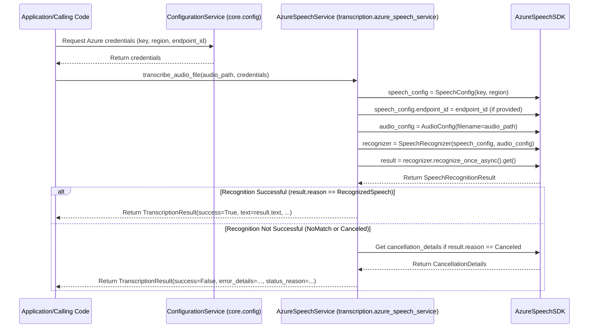

# Azure Speech-to-Text Integration - Design Considerations

## 1. Architectural Thoughts

*   **Modular Design:** The Azure Speech-to-Text functionality should be encapsulated within its own module/class (e.g., `azure_speech_service.py` or similar, within a `transcription` package as per project structure).
*   **Configuration Management:** Configuration (API keys, region, endpoint ID) will be managed via a central configuration mechanism (e.g., Pydantic `BaseSettings` loading from `.env` files), as suggested in `project_folder_structure.md` and `azure_speech_to_text_feature.md`.
*   **Abstraction:** The core transcription logic should provide a clear interface that hides the complexities of the Azure SDK from the calling code. It should accept an audio file path or directory path and return a structured result (or a collection of results for directory input).
*   **File Handling for Directories:** When a directory is provided:
    *   The service should iterate through files in the specified directory (non-recursively by default, with an option for recursive processing).
    *   It should identify supported audio formats (e.g., filter by `.wav` extension initially).
    *   Each identified audio file will be processed individually.
    *   Consider concurrent processing of files in a directory up to a configurable limit to improve throughput, while respecting Azure rate limits.
*   **Error Handling:** Robust error handling is crucial. This includes:
    *   Catching exceptions from the SDK (e.g., network issues, authentication problems).
    *   Interpreting the `result.reason` and `result.cancellation_details` from Azure to provide meaningful error messages or status codes.
*   **Result Object:** A Pydantic model should be defined to represent the transcription result. This model will standardize the output and make it easy to consume. It should include fields like:
    *   `success: bool`
    *   `text: Optional[str]`
    *   `status_reason: str` (e.g., "RecognizedSpeech", "NoMatch", "Canceled")
    *   `error_details: Optional[str]`
    *   `duration_ms: Optional[float]`
    *   `offset_ms: Optional[float]`
*   **Batch Result Object:** For directory processing, a separate Pydantic model should represent the batch outcome, containing a summary (total files, successes, failures) and a list of individual `AzureTranscriptionResult` objects, each associated with its original filename.

## 2. Component Interactions



## 3. Visual Sketches / Data Structures

**Pydantic Model for Transcription Result (per file):**

```python
# In transcription/models.py or a shared models file

from typing import Optional, List
from pydantic import BaseModel, FilePath

class AzureTranscriptionResult(BaseModel):
    """Represents the outcome of an Azure Speech-to-Text operation."""
    success: bool
    text: Optional[str] = None
    status_reason: str  # e.g., "RecognizedSpeech", "NoMatch", "Canceled - Error", "Canceled - EndOfStream"
    error_details: Optional[str] = None
    raw_result_reason: Optional[str] = None # Stores the raw SpeechSDK.ResultReason enum as string
    raw_cancellation_reason: Optional[str] = None # Stores raw SpeechSDK.CancellationReason if applicable
    duration_ms: Optional[float] = None # Duration of recognized speech in milliseconds
    offset_ms: Optional[float] = None   # Offset of recognized speech in milliseconds
    original_file_path: Optional[FilePath] = None # To track source file in batch operations

    # Optional: could include more fields from the SDK if needed, like confidence scores if available/requested
```

**Pydantic Model for Batch Transcription Result:**

```python
# In transcription/models.py

class BatchTranscriptionReportItem(BaseModel):
    """Report item for a single file in a batch operation."""
    original_file: FilePath
    transcription_result: AzureTranscriptionResult

class AzureBatchTranscriptionResult(BaseModel):
    """Represents the outcome of a batch Azure Speech-to-Text operation on a directory."""
    total_files_processed: int
    successful_transcriptions: int
    failed_transcriptions: int
    results: List[BatchTranscriptionReportItem]
```

**Configuration Class (Example Snippet):**

```python
# In core/config.py

from pydantic_settings import BaseSettings
from pydantic import Field

class AppSettings(BaseSettings):
    SPEECH_KEY: Optional[str] = Field(None, env="SPEECH_KEY")
    SPEECH_REGION: Optional[str] = Field(None, env="SPEECH_REGION")
    SPEECH_ENDPOINT_ID: Optional[str] = Field(None, env="SPEECH_ENDPOINT_ID")

    class Config:
        env_file = ".env"
        env_file_encoding = "utf-8"

settings = AppSettings()
```

## 4. Key Method Signature (Illustrative)

```python
# In transcription/azure_speech_service.py

import azure.cognitiveservices.speech as speechsdk
import os
import glob
from typing import Optional, List
from pathlib import Path

from .models import AzureTranscriptionResult, AzureBatchTranscriptionResult, BatchTranscriptionReportItem
from core.config import settings

class AzureSpeechService:
    def __init__(self, speech_key: str, speech_region: str, speech_endpoint_id: Optional[str] = None):
        self.speech_key = speech_key
        self.speech_region = speech_region
        self.speech_endpoint_id = speech_endpoint_id

        if not self.speech_key or not self.speech_region:
            raise ValueError("SPEECH_KEY and SPEECH_REGION must be provided.")

        self.speech_config = speechsdk.SpeechConfig(subscription=self.speech_key, region=self.speech_region)
        if self.speech_endpoint_id:
            self.speech_config.endpoint_id = self.speech_endpoint_id
        # Potentially set other speech_config properties here if needed (e.g., profanity options, language)

    def _transcribe_single_file(self, audio_file_path: Path) -> AzureTranscriptionResult:
        """Helper method to transcribe a single audio file."""
        audio_config = speechsdk.audio.AudioConfig(filename=str(audio_file_path))
        speech_recognizer = speechsdk.SpeechRecognizer(speech_config=self.speech_config, audio_config=audio_config)

        try:
            result = speech_recognizer.recognize_once_async().get()
            duration_ms = result.duration / 10000  # Convert ticks (100ns) to ms
            offset_ms = result.offset / 10000    # Convert ticks (100ns) to ms

            if result.reason == speechsdk.ResultReason.RecognizedSpeech:
                return AzureTranscriptionResult(
                    success=True,
                    text=result.text,
                    status_reason="RecognizedSpeech",
                    raw_result_reason=str(result.reason),
                    duration_ms=duration_ms,
                    offset_ms=offset_ms,
                    original_file_path=audio_file_path
                )
            elif result.reason == speechsdk.ResultReason.NoMatch:
                return AzureTranscriptionResult(
                    success=False,
                    status_reason="NoMatch",
                    raw_result_reason=str(result.reason),
                    error_details=f"No speech could be recognized. Reason: {result.no_match_details}",
                    original_file_path=audio_file_path
                )
            elif result.reason == speechsdk.ResultReason.Canceled:
                cancellation_details = result.cancellation_details
                return AzureTranscriptionResult(
                    success=False,
                    status_reason=f"Canceled - {str(cancellation_details.reason)}",
                    raw_result_reason=str(result.reason),
                    raw_cancellation_reason=str(cancellation_details.reason),
                    error_details=f"Recognition canceled. Reason: {cancellation_details.reason}. Error details: {cancellation_details.error_details}",
                    original_file_path=audio_file_path
                )
            else: # Should not happen based on SDK docs for recognize_once_async
                return AzureTranscriptionResult(
                    success=False, 
                    status_reason="UnknownFailure",
                    raw_result_reason=str(result.reason),
                    error_details="An unknown error occurred during speech recognition.",
                    original_file_path=audio_file_path
                )
        except Exception as e:
            # Catch any other unexpected exceptions during the process
            return AzureTranscriptionResult(
                success=False,
                status_reason="ExceptionDuringProcessing",
                error_details=str(e),
                original_file_path=audio_file_path
            )

    def transcribe_path(self, input_path: str, recursive: bool = False, audio_extensions: List[str] = None) -> (AzureTranscriptionResult | AzureBatchTranscriptionResult):
        """Transcribes a single audio file or all supported audio files in a directory."""
        if audio_extensions is None:
            audio_extensions = [".wav"] # Default supported extension
        
        path_obj = Path(input_path)

        if path_obj.is_file():
            if path_obj.suffix.lower() in audio_extensions:
                return self._transcribe_single_file(path_obj)
            else:
                return AzureTranscriptionResult(
                    success=False,
                    status_reason="UnsupportedFileExtension",
                    error_details=f"File extension {path_obj.suffix} is not in supported list: {audio_extensions}",
                    original_file_path=path_obj
                )
        elif path_obj.is_dir():
            batch_results: List[BatchTranscriptionReportItem] = []
            files_to_process = []
            for ext in audio_extensions:
                pattern = f"**/*{ext}" if recursive else f"*{ext}"
                files_to_process.extend(list(path_obj.glob(pattern)))
            
            successful_count = 0
            failed_count = 0

            for audio_file in files_to_process:
                if audio_file.is_file(): # Ensure it's a file, not a subdir matched by glob
                    result = self._transcribe_single_file(audio_file)
                    batch_results.append(BatchTranscriptionReportItem(original_file=audio_file, transcription_result=result))
                    if result.success:
                        successful_count += 1
                    else:
                        failed_count += 1
            
            return AzureBatchTranscriptionResult(
                total_files_processed=len(files_to_process),
                successful_transcriptions=successful_count,
                failed_transcriptions=failed_count,
                results=batch_results
            )
        else:
            return AzureTranscriptionResult(
                success=False,
                status_reason="InvalidPath",
                error_details=f"Input path {input_path} is not a valid file or directory."
            )

# Example Usage (illustrative)
# if __name__ == "__main__":
#     # This would typically come from a central config loader
#     speech_service = AzureSpeechService(
#         speech_key=settings.SPEECH_KEY,
#         speech_region=settings.SPEECH_REGION,
#         speech_endpoint_id=settings.SPEECH_ENDPOINT_ID
#     )
#     # Single file
#     transcription_outcome_single = speech_service.transcribe_path("path/to/your/audio.wav")
#     if isinstance(transcription_outcome_single, AzureTranscriptionResult):
#         print("--- Single File Result ---")
#         print(transcription_outcome_single.json(indent=2))
# 
#     # Directory
#     transcription_outcome_batch = speech_service.transcribe_path("path/to/your_audio_directory/")
#     if isinstance(transcription_outcome_batch, AzureBatchTranscriptionResult):
#         print("--- Batch Directory Result ---")
#         print(transcription_outcome_batch.json(indent=2, exclude_none=True)) # exclude_none for cleaner batch output

```

## 5. Considerations from `project_folder_structure.md`

*   The `AzureSpeechService` class and its Pydantic model `AzureTranscriptionResult` would reside in `src/transcription/` (e.g., `src/transcription/azure_speech_service.py` and `src/transcription/models.py` respectively).
*   Configuration loading (`AppSettings`) would be in `src/core/config.py`.
*   Unit tests for `AzureSpeechService` would be in `tests/transcription/test_azure_speech_service.py`. 